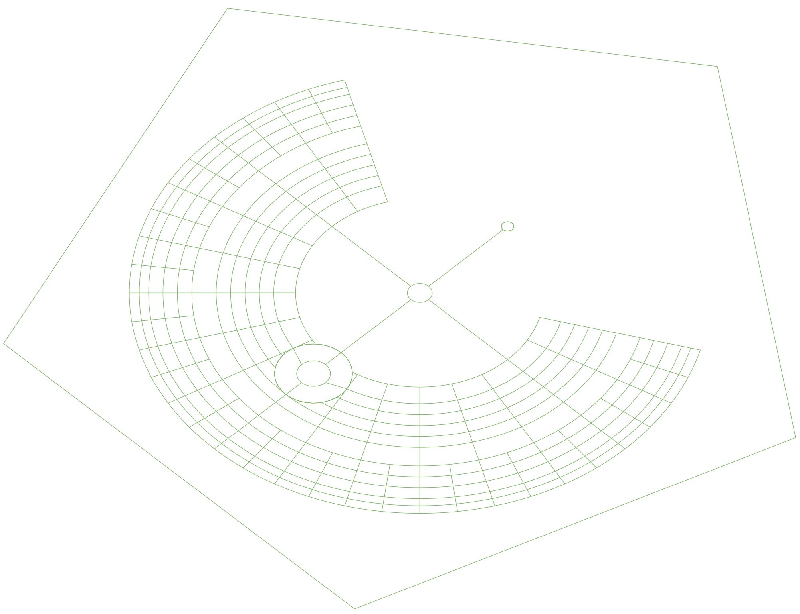

# Black Rock City Map Generator

This set of python scripts generates geospatially accurate maps for Black Rock City, home of Burning Man.

Currently, it only generates the street layout based on the 2023 proposed layout, and outputs it in ESRI Shapefile format.

Future generations will generate GeoJSON, and possibly other output formats.

In QGis, the shapefile renders like this:

## Dockerfile

### Build

	docker build -t brc-map-generator .

### Run

	docker run --rm -v ${PWD}:/output brc-map-generator:latest
